<!DOCTYPE html>
<html lang="en">
<head>
<meta charset="UTF-8">
<meta name="viewport" content="width=device-width, initial-scale=1.0">
<title>SwishZone</title>

</head>

<body>

<!-- HEADER -->

<header>

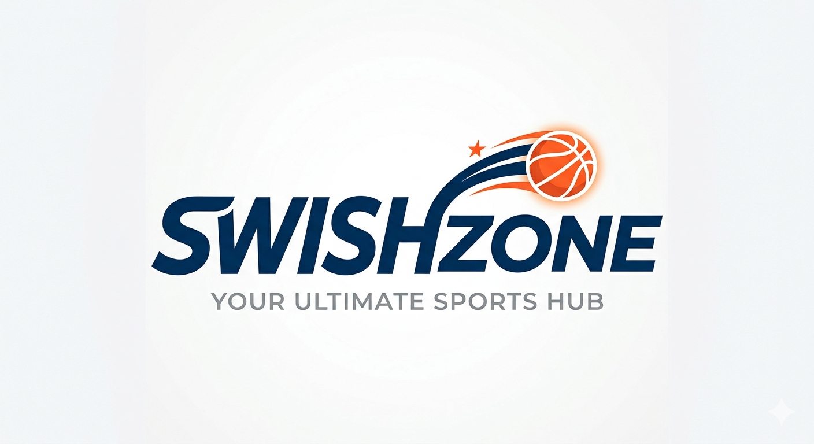
SwishZone

<a href="#home">Home</a>
<a href="#products">Products</a>
<a href="#training">Training</a>
<a href="#about">About</a>

</header>

<!-- HOME -->

<section class="front-page" id="home">

<h1>Welcome to SwishZone 🏀</h1>

A place where you can find the best basketball gear and training resources. 
    We provide the best gear, from high-performance shoes and jerseys to 
    essential training equipment. We offer professional training programs designed to enhance your skills, 
    build confidence, and elevate your game on the court. Our mission is to
     support every player’s journey.

</section>

<!-- PRODUCTS -->

<section class="products-section" id="products">

<h2>Shoes</h2>

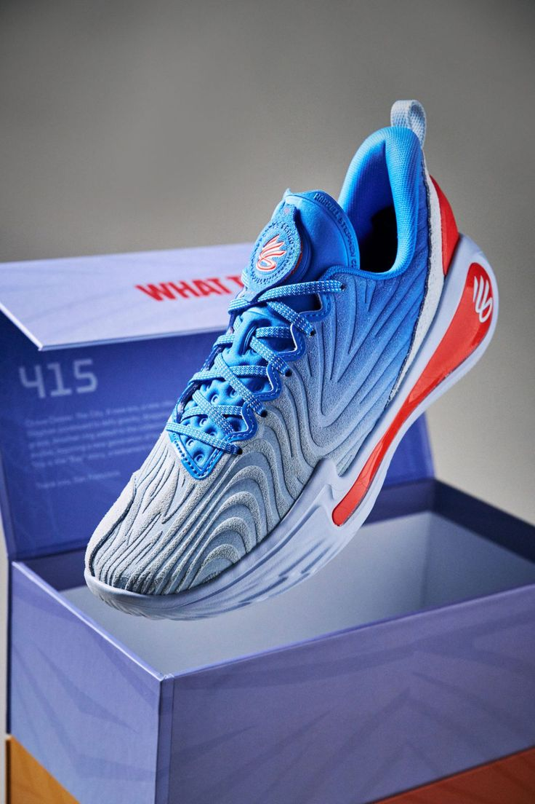
<h3>Curry 12</h3>

$273

<button>Buy</button>

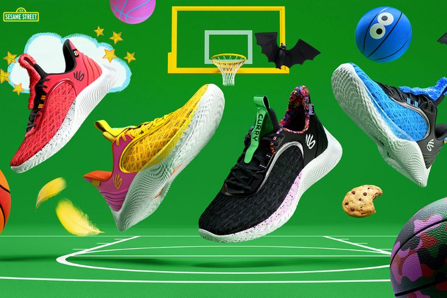
<h3>Curry 9</h3>

$196

<button>Buy</button>

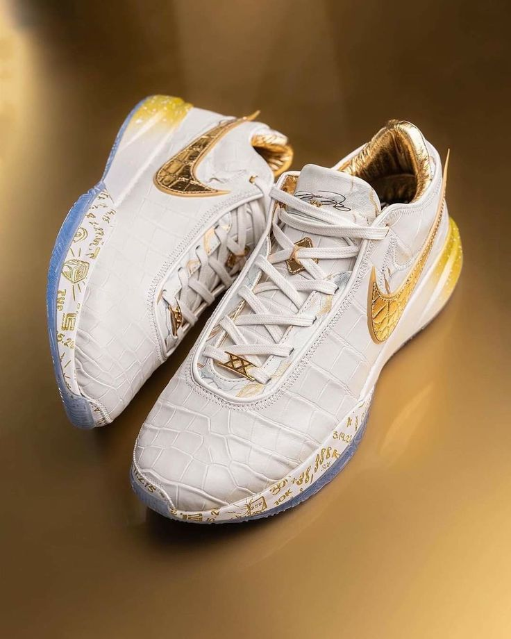
<h3>LeBron 20</h3>

$253

<button>Buy</button>

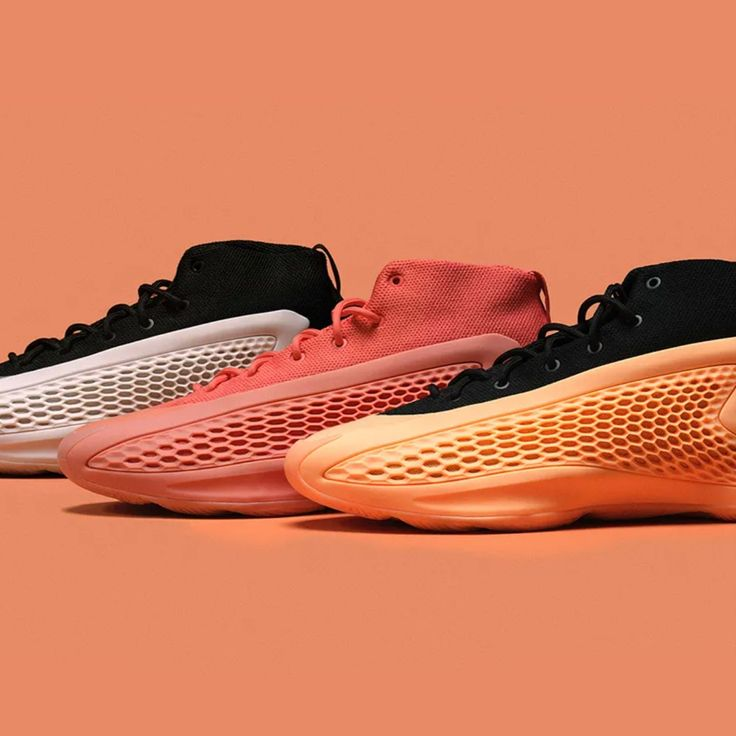
<h3>AE1</h3>

$147

<button>Buy</button>

<h2>Jerseys</h2>

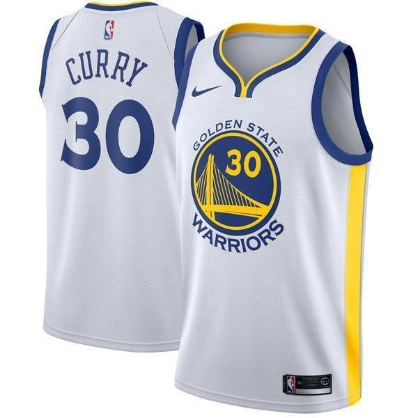
<h3>Curry30 Jersey</h3>

$110

<button>Buy</button>

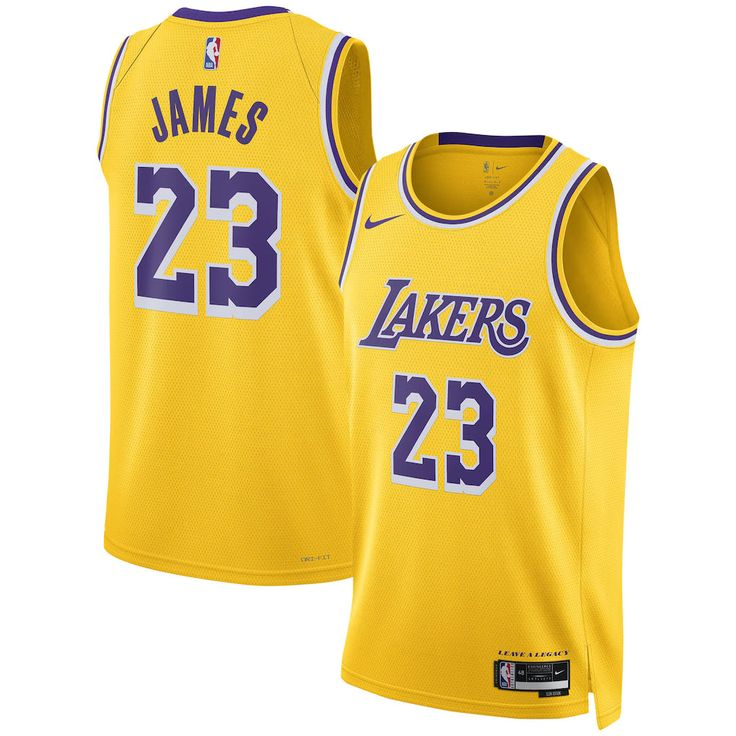
<h3>Lebron23 Jersey</h3>

$115

<button>Buy</button>

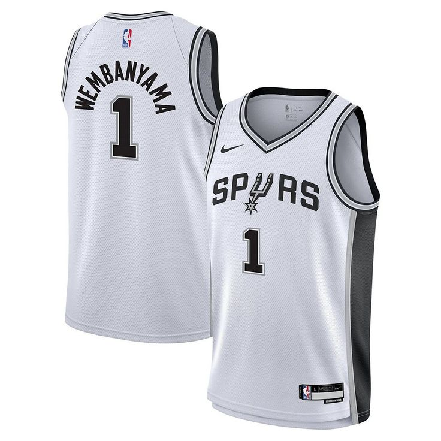
<h3>Wembanyama1 Jersey</h3>

$105

<button>Buy</button>

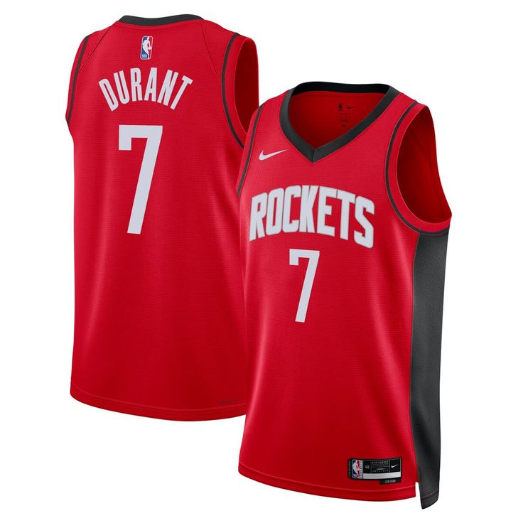
<h3>Kd35 Jersey</h3>

$108

<button>Buy</button>

<h2>Bands</h2>

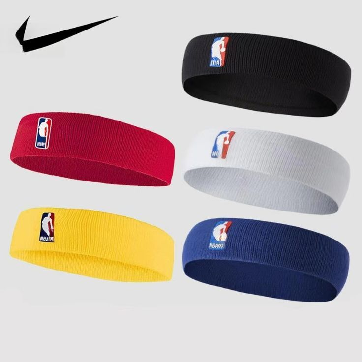
<h3>Head Band</h3>

$20

<button>Buy</button>

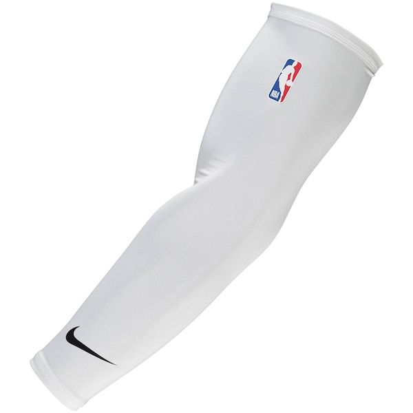
<h3>Arm Sleeve</h3>

$28

<button>Buy</button>

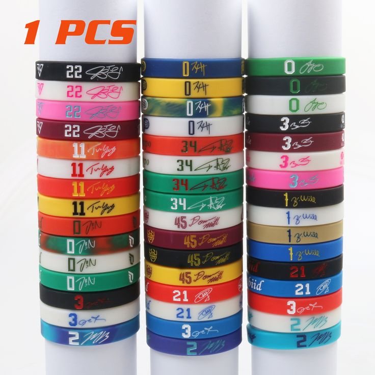
<h3>Wrist Band</h3>

$15

<button>Buy</button>

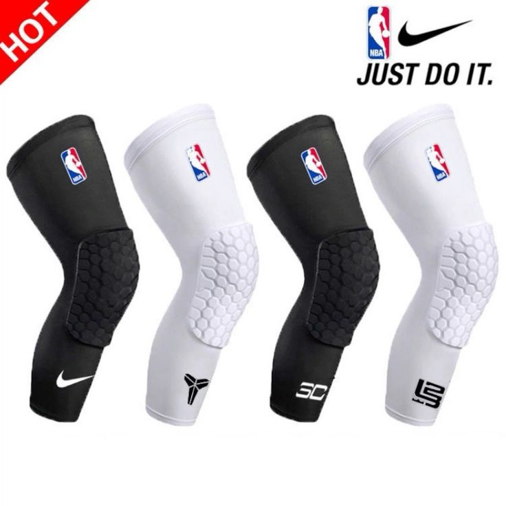
<h3>Knee pads</h3>

$22

<button>Buy</button>

<h2>Basketball Ball</h2>

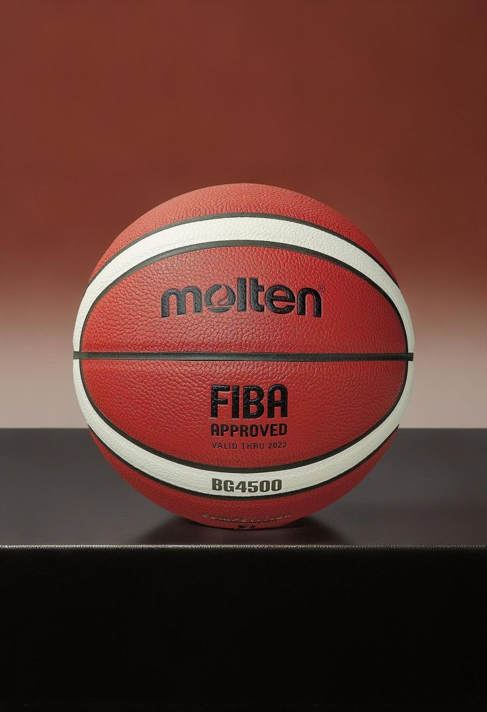
<h3>Molten</h3>

$43

<button>Buy</button>

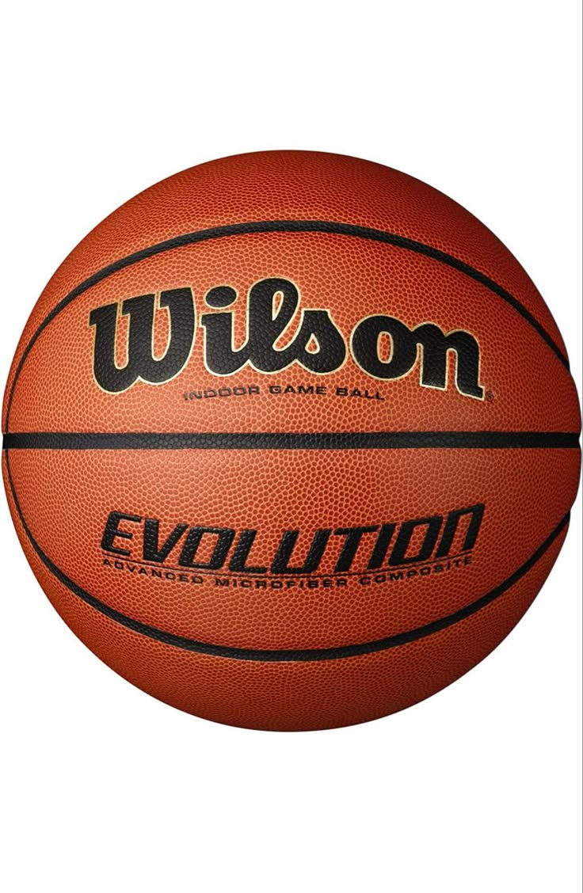
<h3>Wilson</h3>

$65

<button>Buy</button>

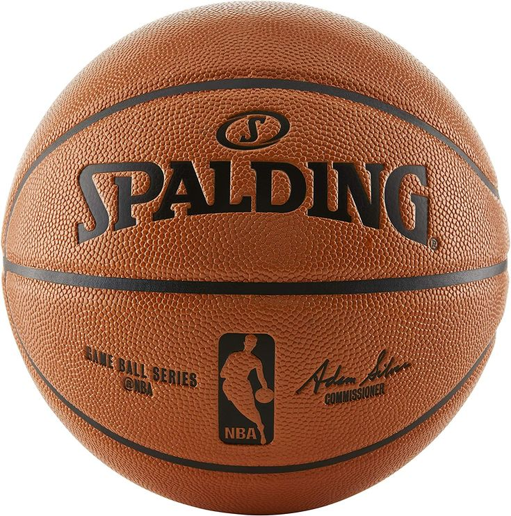
<h3>Spalding</h3>

$51

<button>Buy</button>

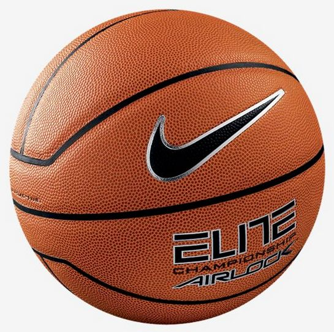
<h3>Elite</h3>

$36

<button>Buy</button>

</section>

<!-- TRAINING -->

<section class="training" id="training">

<h2>Basketball Training</h2>

Improve your shooting, ball handling, defense, and basketball IQ
with our professional basketball training sessions designed for
players of all skill levels.

</section>

<!-- ABOUT -->

<section class="about" id="about">

<h2>About SwishZone</h2>

SwishZone was created for basketball players who want the best gear
and elite training. Our mission is to help athletes improve their
skills while providing high-quality basketball shoes, jerseys,
bands, and equipment to dominate the court.

</section>

<footer>

© 2026 SwishZone

</footer>

</body>
</html>
